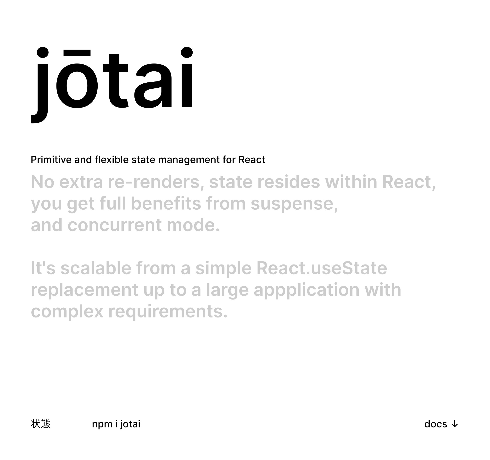
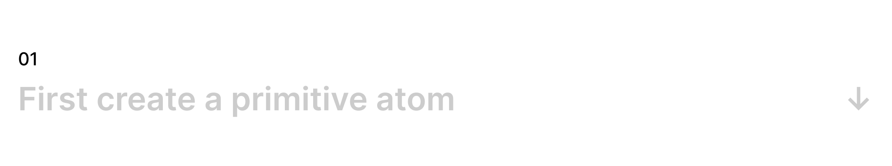
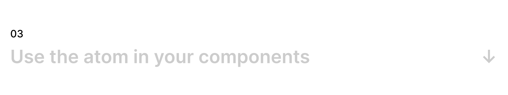
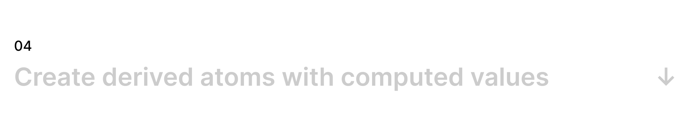
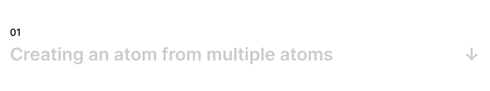
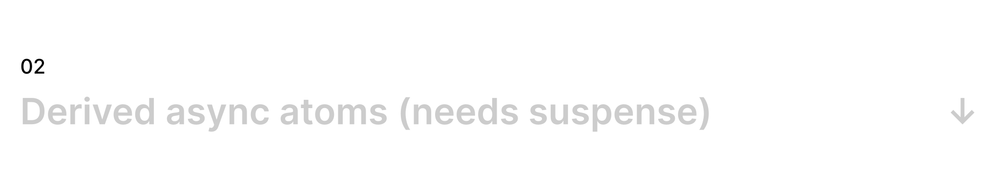
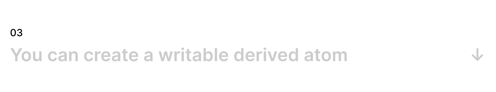
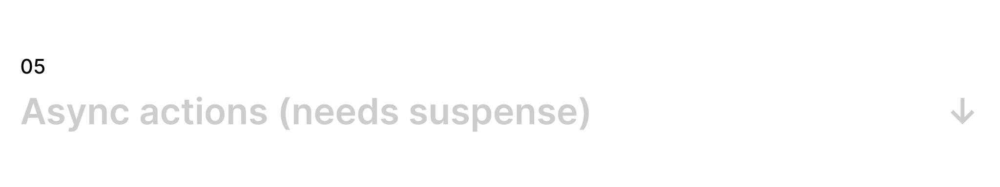

<p align="center">
  <a id="cover" href="#cover"></a>
</p>

[](https://github.com/react-spring/jotai/actions?query=workflow%3ALint)
[](https://bundlephobia.com/result?p=jotai)
[](https://www.npmjs.com/package/jotai)
[](https://www.npmjs.com/package/jotai)

Jotai is pronounced "joe-tie" and means "state" in Japanese.

You can try a live demo [here](https://codesandbox.io/s/jotai-demo-47wvh).

#### How does Jotai differ from Recoil?

* Minimalistic API
* No string keys
* TypeScript oriented

<a id="firstcreateaprimitiveatom" href="#firstcreateaprimitiveatom"></a>

An atom represents a piece of state. All you need is to specify an initial value, which can be primitive values like strings and numbers, objects and arrays. You can create as many primitive atoms as you want.

```jsx
import { atom } from 'jotai'

const countAtom = atom(0)
const countryAtom = atom("Japan")
const citiesAtom = atom(["Tokyo", "Kyoto", "Osaka"])
const mangaAtom = atom({ "Dragon Ball": 1984, "One Piece": 1997, "Naruto": 1999 })
```

<a id="wrapyourcomponenttree" href="#wrapyourcomponenttree"></a>

You can only use atoms under this component tree.

```jsx
import { Provider } from 'jotai'

const Root = () => (
  <Provider>
    <App />
  </Provider>
)
```

<a id="usetheatom" href="#usetheatom"></a>

It can be used just like `React.useState`:

```jsx
import { useAtom } from 'jotai'

function Counter() {
  const [count, setCount] = useAtom(countAtom)
  return (
    <h1>
      {count}
      <button onClick={() => setCount(c => c + 1)}>one up</button>
```

<a id="derivedatomswithcomputedvalues" href="#derivedatomswithcomputedvalues"></a>

A new read-only atom can be created from existing atoms by passing a read function as the first argument. `get` allows you to fetch the contextual value of any atom.

```jsx
const doubledCountAtom = atom(get => get(countAtom) * 2)

function DoubleCounter() {
  const [doubledCount] = useAtom(doubledCountAtom)
  return <h2>{doubledCount}</h2>
```

<a id="recipes" href="#recipes"></a>

<a id="multipleatoms" href="#multipleatoms"></a>

You can combine multiple atoms to create a derived atom.

```jsx
const count1 = atom(1)
const count2 = atom(2)
const count3 = atom(3)

const sum = atom(get => get(count1) + get(count2) + get(count3))
```

Or if you like fp patterns ... 

```jsx
const atoms = [count1, count2, count3, ...otherAtoms]
const sum = atom(get => atoms.map(get).reduce((acc, count) => acc + count))
```

<a id="derivedasyncatoms" href="#derivedasyncatoms"></a>

You can make the read function an async function, too.

```jsx
const urlAtom = atom("https://json.host.com")
const fetchUrlAtom = atom(
  async get => {
    const response = await fetch(get(urlAtom))
    return await response.json()
  }
)

function Status() {
  // Re-renders the component after urlAtom changed and the async function above concludes
  const [json] = useAtom(fetchUrlAtom)
```

<a id="writabledrivedatom" href="#writabledrivedatom"></a>

Specify a write function at the second argument. `get` will return the current value of an atom, `set` will update an atoms value.

```jsx
const decrementCountAtom = atom(
  get => get(countAtom),
  (get, set, _arg) => set(countAtom, get(countAtom) - 1),
)

function Counter() {
  const [count, decrement] = useAtom(decrementCountAtom)
  return (
    <h1>
      {count}
      <button onClick={decrement}>Decrease</button>
```

<a id="writeonlyatoms" href="#writeonlyatoms"></a>

Just do not define a read function.

```jsx
const multiplyCountAtom = atom(null, (get, set, by) => set(countAtom, get(countAtom) * by))

function Controls() {
  const [, multiply] = useAtom(multiplyCountAtom)
  return <button onClick={() => multiply(3)}>triple</button>
```

<a id="asyncactions" href="#asyncactions"></a>

Just make the write function an async function and call `set` when you're ready.

```jsx
const fetchCountAtom = atom(
  get => get(countAtom),
  async (_get, set, url) => {
    const response = await fetch(url)
    set(countAtom, (await response.json()).count)
  }
)

function Controls() {
  const [count, compute] = useAtom(fetchCountAtom)
  return <button onClick={() => compute("http://count.host.com")}>compute</button>
```

----

## More information

We will be organizing some more information later. Meanwhile, please see WIP materials in the issues.
- [API Doc](https://github.com/react-spring/jotai/issues/27)
- [Example code snippets](https://github.com/react-spring/jotai/labels/has%20snippet)
